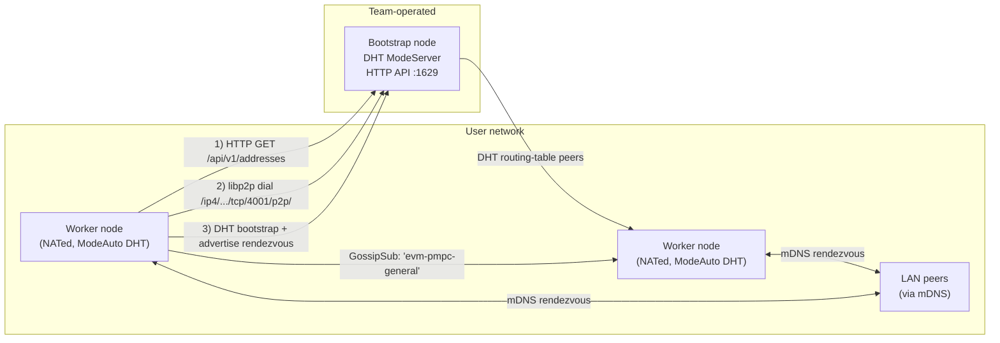
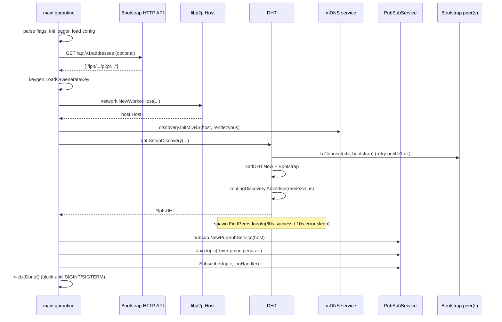

# evm-pmpc-node — Architecture & Codebase Guide

This document is a deep, end-to-end walk-through of the current `evm-pmpc-node`
codebase. It is meant for a new contributor who has just cloned the repository
and wants to understand exactly what the code does today, file by file, before
they start changing anything.

It intentionally does **not** describe what the project will eventually do for
MPC; for that, see [`rust-mpc-sidecar-design.md`](./rust-mpc-sidecar-design.md).
This document only covers what is actually in the Go code as of today.

---

> **If you have ten minutes**, read [§1](#1-what-this-project-is),
> [§2](#2-top-level-repository-layout), [§4](#4-end-to-end-startup-flows),
> and [§12.1](#121-run-a-2-node-test-on-localhost). That gives you a
> running two-node network and the mental model to navigate everything
> else.

## 1. What this project is

`evm-pmpc-node` is the Go networking layer for a future EVM-targeted threshold
MPC ("private MPC", or PMPC) system. The Go binary is responsible for:

- giving each node a stable cryptographic identity
- bringing up a libp2p host
- discovering other peers (via known bootstrap nodes, DHT, and mDNS)
- joining a shared GossipSub pubsub topic
- exposing a small HTTP API on bootstrap nodes so workers can fetch
  bootstrap-peer addresses dynamically

There are two binaries:

| Binary                  | Source                       | Role |
| ----------------------- | ---------------------------- | ---- |
| `evm-pmpc-bootstrap`    | `cmd/bootstrapnode/main.go`  | Long-lived, publicly reachable node operated by the team. Acts as a DHT server and exposes the `/api/v1/addresses` HTTP endpoint. |
| `evm-pmpc-node`         | `cmd/node/main.go`           | Worker node operated by users. Connects through the bootstrap nodes, joins the DHT and pubsub, and (eventually) participates in MPC. |

Both binaries share the same internal/pkg code; the difference is mostly in how
the libp2p host is configured (server-mode DHT, public reachability, API
enabled) and which config file they load by default.

### 1.1 System diagram



---

## 2. Top-level repository layout

```text
.
├── api/                          HTTP API server (bootstrap) + client (worker)
│   ├── client.go
│   └── server.go
├── build/                        Dockerfiles
│   ├── Dockerfile.bootstrapnode
│   └── Dockerfile.node
├── cmd/                          Binary entrypoints
│   ├── bootstrapnode/main.go
│   └── node/main.go
├── config-bootstrap.yaml         Default config for the bootstrap binary
├── config.yaml                   Default config for the worker binary
├── deployments/                  docker-compose files
│   ├── docker-compose.bootstrap.yaml
│   └── docker-compose.worker.yaml
├── docs/
│   ├── architecture.md           This document
│   └── rust-mpc-sidecar-design.md
├── go.mod / go.sum
├── internal/                     Implementation packages (not importable externally)
│   ├── dht/dht.go
│   ├── discovery/mdns.go
│   ├── network/network.go
│   └── pubsub/pubsub.go (+ pubsub_test.go)
├── Makefile
├── pkg/                          Reusable packages
│   ├── config/config.go (+ config_test.go)
│   ├── keygen/keygen.go
│   └── logger/logger.go
└── README.txt
```

The Go module path is `github.com/evm-pmpc/evm-pmpc-node` and the project
targets Go 1.25.

The split between `internal/` and `pkg/` follows the standard Go convention:
`internal/` packages can only be imported by code inside this module,
`pkg/` packages are intended to be reusable.

---

## 3. The libp2p model in 60 seconds

The whole project is built on top of [libp2p](https://libp2p.io/). If you are
new to libp2p, here is the bare minimum you need to understand the code:

- A **Host** is the libp2p object that owns the local node's identity, listens
  on network addresses, and exposes streams to peers.
- A **PeerID** is the hash of the node's public key. Peer IDs look like
  `12D3KooW…`.
- A **multiaddr** describes how to reach a peer, e.g.
  `/ip4/140.238.226.231/tcp/4001/p2p/12D3KooWL3djSAb7XWKMGVZCNbQEchV9s3TKcbgx2Fm1E34Rqeaa`.
- **DHT (Kademlia)**: a key-value-style overlay used for *peer routing* and
  *content routing*. Bootstrap nodes run the DHT in **server mode**; workers
  run as DHT clients but still answer queries.
- **GossipSub / pubsub**: a publish/subscribe layer built on top of libp2p.
  Peers join named **topics** and receive every message published to them.
- **mDNS**: zero-config peer discovery on the local LAN using multicast DNS.
- **Connection manager**: keeps the open-connection count between
  `min_peers` and `max_peers`, with a grace period before pruning.
- **Resource manager**: enforces global limits on memory, streams, and
  connections so a misbehaving peer cannot exhaust local resources.
- **AutoRelay / AutoNAT / hole-punching**: NAT-traversal helpers. A worker
  behind NAT will use bootstrap nodes as **static relays** and try to
  hole-punch direct connections via DCUtR.

Everything in `internal/network`, `internal/dht`, `internal/discovery`, and
`internal/pubsub` is a thin domain-specific wrapper around these libp2p
primitives.

---

## 4. End-to-end startup flows

### 4.1 Bootstrap node (`cmd/bootstrapnode/main.go`)

1. Parse the `-config` flag (default `config-bootstrap.yaml`).
2. Initialize the Zap logger in console mode; if the loaded config says
   `logging.format: json`, swap it for the JSON production logger.
3. Load configuration via `pkg/config.Load`.
4. Create a cancellable context that fires on `SIGINT`/`SIGTERM`.
5. Load or generate the node's Ed25519 identity key via
   `pkg/keygen.LoadOrGenerateKey` — keyed by `identity.key_file`.
6. Build a `connmgr` with the configured peer floor/ceiling and a 1-minute
   grace period, and a default-limit `rcmgr`.
7. Construct the libp2p host, listening on TCP and QUIC-v1 on
   `network.listen_port`, with:
    - `NATPortMap` (UPnP / NAT-PMP)
    - `ForceReachabilityPublic` (skip AutoNAT probing — bootstrap nodes are
      assumed to be on a public IP)
    - `EnableNATService` and `EnableRelayService` (act as a relay for others)
8. If `api.enabled` is true, start the HTTP API server on `api.port`
   (`api.NewServer(host, port, authToken).Start()`). The server runs in its
   own goroutine; the `Start()` call returns immediately.
9. Construct a Kademlia DHT in **server mode** with the configured
   `discovery.protocol_prefix` and call `Bootstrap`. Server mode means this
   node will store and answer DHT queries on behalf of the network.
10. Log the host's PeerID and every listen multiaddr (these are exactly the
    strings that workers paste into `bootstrap_addrs`).
11. Block on `ctx.Done()` until a signal arrives, then unwind via deferred
    `Close()` calls on the host and DHT.

The bootstrap binary intentionally does **not** run mDNS, the routing
discovery loop, or pubsub. Its only jobs are *be reachable* and *answer DHT
queries*.

### 4.2 Worker node (`cmd/node/main.go`)

1. Parse the `-config` flag (default `config.yaml`).
2. Initialize the logger (same dance as the bootstrap node).
3. Load configuration.
4. Convert each string in `network.bootstrap_addrs` into a `peer.AddrInfo`,
   failing fast on malformed entries.
5. **Dynamic bootstrap fetch**: if `network.bootstrap_api` is set, GET
   `<api>/api/v1/addresses` via `api.FetchBootstrapAddresses` and append any
   parseable addresses to the static list. Failures here only log a warning;
   the node falls back to the static list.
6. Create a signal-cancellable context.
7. Load or generate the worker's Ed25519 identity key.
8. Build the worker libp2p host via `network.NewWorkerHost`. The `ctx`
   parameter is accepted but never used inside that function — libp2p's
   `New` is options-only. The host is configured very differently from
   the bootstrap host — see [§5.4](#54-internalnetwork).
9. Start mDNS local discovery via `discovery.InitMDNS`.
10. Start DHT discovery via `dht.SetupDiscovery`. This blocks until at
    least one bootstrap peer is reachable, then advertises the configured
    rendezvous string and spawns a background goroutine that periodically
    queries the rendezvous and dials any peers it finds.
11. Log the node's PeerID and all `<multiaddr>/p2p/<peerID>` strings.
12. Build the GossipSub-based `PubSubService`.
13. Join the configured `pubsub.topic` (defaulting to `"evm-pmpc-general"`)
    and register a single handler that just logs every received message's
    type and sender.
14. Block on `ctx.Done()` until a signal arrives. Cleanup is via `defer` on
    the host, DHT, and pubsub service.

There is intentionally **no MPC logic anywhere in the Go code yet**. The
worker simply joins the network and idles on the topic.



---

## 5. Package-by-package walkthrough

### 5.1 `pkg/config` — configuration loading

**File:** `pkg/config/config.go`

Configuration is loaded with [koanf](https://github.com/knadh/koanf):

1. A YAML file is read from the path passed to `Load(path string)`. The
   provider is `file.Provider(path)` and the parser is `yaml.Parser()`.
2. Environment variables prefixed with `PMPC_` are merged on top of the file
   values. The transformation is:

   ```text
   PMPC_LOGGING_LEVEL  →  logging.level
   PMPC_IDENTITY_KEY_FILE → identity.key_file
   PMPC_NETWORK_BOOTSTRAP_API → network.bootstrap_api
   ```

   The transformation is implemented inline:

```61:65:pkg/config/config.go
	k.Load(env.Provider("PMPC_", ".", func(s string) string {
		return strings.ReplaceAll(strings.ToLower(
			strings.TrimPrefix(s, "PMPC_")), "_", ".")
	}), nil)
```

   This means env vars cannot override scalar values inside a list (e.g.
   you cannot inject a single bootstrap address through env). For the
   docker-compose deployments, env override is used to pin the key file path
   onto the persistent volume (see `deployments/docker-compose.*.yaml`).

3. **The error returned by the env loader is silently discarded** — note
   the bare `k.Load(...)` call with no `if err != nil` check. If the env
   provider ever fails (e.g. malformed transformation), the failure is
   invisible.

4. The merged tree is unmarshalled into a strongly-typed `Config` struct:

```13:20:pkg/config/config.go
type Config struct {
	Identity  IdentityConfig  `koanf:"identity"`
	API       APIConfig       `koanf:"api"`
	Network   NetworkConfig   `koanf:"network"`
	Discovery DiscoveryConfig `koanf:"discovery"`
	PubSub    PubSubConfig    `koanf:"pubsub"`
	Logging   LoggingConfig   `koanf:"logging"`
}
```

The sub-structs are documented inline in the same file. Note that none of
these fields have validators — out-of-range values (e.g. negative ports) will
silently propagate to libp2p.

**Tests:** `pkg/config/config_test.go` covers happy path, missing-file errors,
and the `PMPC_LOGGING_LEVEL` env override.

### 5.2 `pkg/keygen` — node identity

**File:** `pkg/keygen/keygen.go`

`LoadOrGenerateKey(fileName string) (crypto.PrivKey, error)` is the only
exported function. It implements an idempotent "first run, then reuse"
pattern:

- If the file does not exist, generate a new Ed25519 key pair, marshal the
  private key with `crypto.MarshalPrivateKey`, and write it with mode `0600`
  via `os.WriteFile`.
- Otherwise, read the file and unmarshal it back into a `crypto.PrivKey`.

The caller passes this into `libp2p.Identity(priv)`, which is what
deterministically derives the PeerID. As a result, **the key file is the
node's identity** — losing it means the node gets a brand-new PeerID and any
other peers' DHT/connection-manager state for it becomes stale.

**Atomicity caveat.** `os.WriteFile` opens the path with `O_TRUNC` and then
streams the bytes. A crash or power loss between truncate and write leaves
a zero-length file on disk; on the next start `os.Stat` succeeds, the read
returns `[]byte{}`, and `crypto.UnmarshalPrivateKey` errors out. The node
fails to start until the empty file is deleted. The robust fix is the
standard temp-file + `fsync` + `os.Rename` pattern.

There is also no version byte in the on-disk format. If the marshalling
scheme ever changes, there is no way to migrate cleanly.

The file is referenced by the volume mounts in
`deployments/docker-compose.bootstrap.yaml` and
`deployments/docker-compose.worker.yaml`, which override `identity.key_file`
to point inside `/data` so the key persists across container restarts.

### 5.3 `pkg/logger` — logging setup

**File:** `pkg/logger/logger.go`

Two functions, both replacing the global Zap logger via
`zap.ReplaceGlobals`:

- `Init()` — colored, human-readable console output with the
  `2006-01-02 15:04:05` timestamp format. The level is **hard-coded** to
  `zap.InfoLevel`. Always called first.
- `InitJSON()` — production JSON logger from `zap.NewProduction()`, which
  is itself hard-coded to `InfoLevel`. Called after config load if
  `logging.format == "json"`.

Throughout the codebase, logging is done via the package-level
`zap.L().Info/Warn/Error/...` calls, so swapping the global suffices.

**Two things to watch out for:**

1. The configured `logging.level` is **never** honored. `Init` ignores it
   and `zap.NewProduction` also pins level to info. Setting
   `logging.level: debug` in the YAML or `PMPC_LOGGING_LEVEL=debug` does
   nothing today.
2. Both functions discard the error returned by `cfg.Build()` /
   `zap.NewProduction()` (`l, _ := ...`). If the build ever fails, `l` is
   `nil`, `zap.ReplaceGlobals(nil)` is invoked, and the next `zap.L()`
   call panics. In practice these builds don't fail with the current
   inputs, but it's a latent footgun.

### 5.4 `internal/network` — worker libp2p host

**File:** `internal/network/network.go`

`NewWorkerHost(ctx, priv, listenPort, minPeers, maxPeers, bootstrapAddrs)`
returns a configured `host.Host`:

```31:45:internal/network/network.go
	return libp2p.New(
		libp2p.Identity(priv),
		libp2p.ListenAddrStrings(
			fmt.Sprintf("/ip4/0.0.0.0/tcp/%d", listenPort),
			fmt.Sprintf("/ip4/0.0.0.0/udp/%d/quic-v1", listenPort),
		),
		libp2p.NATPortMap(),
		libp2p.EnableHolePunching(),
		libp2p.EnableAutoRelayWithStaticRelays(bootstrapAddrs),
		libp2p.EnableAutoNATv2(),
		libp2p.EnableNATService(),
		libp2p.ConnectionManager(cm),
		libp2p.ResourceManager(rm),
	)
```

Key differences vs. the bootstrap host:

- **No `ForceReachabilityPublic`**: workers are assumed to be behind NAT and
  run AutoNATv2 to probe their reachability.
- **Hole punching enabled**: lets two NATed peers establish a direct TCP
  connection via DCUtR after meeting through a relay.
- **Auto-relay with static relays = bootstrap nodes**: if the worker is
  unreachable, it asks the bootstrap nodes to relay traffic for it via
  Circuit Relay v2.

The `ctx` parameter is accepted but **not used** anywhere inside the
function — `libp2p.New` takes options only. Today it is dead weight; either
remove it or honor it for early-cancel semantics if startup ever grows
context-aware steps.

### 5.5 `internal/dht` — DHT bootstrap and rendezvous loop

**File:** `internal/dht/dht.go`

`SetupDiscovery(ctx, h, cfg, bootstrapAddrs)` does three sequential things:

#### a) Block until at least one bootstrap peer is reachable

If `bootstrapAddrs` is non-empty, fire one goroutine per bootstrap address
and `WaitGroup`-sync them. Connections that fail are logged at debug level;
each successful connect bumps an `int32` counter atomically. If at least one
worked, fall through. Otherwise, log a warning and retry every 5 seconds
(`select` against `ctx.Done()` so SIGINT during retry exits cleanly).

```28:54:internal/dht/dht.go
			for _, peerinfo := range bootstrapAddrs {
				wg.Add(1)
				go func(p peer.AddrInfo) {
					defer wg.Done()
					if err := h.Connect(ctx, p); err != nil {
						zap.L().Debug("failed to connect to bootstrap node", zap.String("peerID", p.ID.String()), zap.Error(err))
					} else {
						zap.L().Info("connected to bootstrap node", zap.String("peerID", p.ID.String()))
						atomic.AddInt32(&connected, 1)
					}
				}(peerinfo)
			}
			wg.Wait()
```

#### b) Build the DHT and advertise on the rendezvous

Construct a Kademlia DHT with the configured protocol prefix and **no
explicit `Mode` option**, which means it uses the kad-DHT default of
`ModeAuto` — the DHT subscribes to libp2p reachability events and
auto-promotes to server mode only after AutoNAT marks the node publicly
reachable. (Compare to the bootstrap binary which sets
`kadDHT.Mode(kadDHT.ModeServer)` explicitly.)

Then run `dht.Bootstrap(ctx)` to seed the routing-table refresh loop,
create a `routing.NewRoutingDiscovery(dht)`, and call
`util.Advertise(ctx, routingDiscovery, cfg.Rendezvous)`.

`util.Advertise` is a libp2p helper that periodically re-publishes a
"provider record" for the rendezvous string into the DHT. Other peers that
search for the same rendezvous will eventually find this node.

#### c) Background peer-finding loop

A goroutine queries the rendezvous via `routingDiscovery.FindPeers` once a
minute (with a 10-second back-off if the query itself errors). For every
returned peer that isn't us and has at least one address, attempt
`h.Connect(ctx, p)` and log on success.

Two important nuances:

- **The loop runs forever** even if the connection manager already has
  plenty of peers. The connection manager will trim back to the configured
  ceiling on its own grace-period schedule.
- **`time.Sleep` is not interruptible.** Both the 1-minute success sleep
  and the 10-second error sleep are bare `time.Sleep` calls. The
  goroutine only checks `ctx.Done()` between iterations via a non-blocking
  `select default`. Consequence: a `SIGINT` arriving during the sleep
  delays the goroutine's exit by up to one minute. This is one of the
  reasons the worker shutdown can feel sluggish. The fix is to replace
  each `time.Sleep` with a `select { case <-time.After(d): case <-ctx.Done(): return }`.

The function returns the `*kadDht.IpfsDHT` so the caller can `defer
dht.Close()`.

### 5.6 `internal/discovery` — local mDNS discovery

**File:** `internal/discovery/mdns.go`

`InitMDNS(h, rendezvous)` wires up libp2p's mDNS service so peers on the
same LAN find each other without needing the DHT.

The package defines an unexported `discoveryNotifee` struct that satisfies
the `mdns.Notifee` interface:

```12:28:internal/discovery/mdns.go
type discoveryNotifee struct {
	h host.Host
}

func (n *discoveryNotifee) HandlePeerFound(pi peer.AddrInfo) {
	zap.L().Info("mDNS found new peer", zap.String("peerID", pi.ID.String()))

	err := n.h.Connect(context.Background(), pi)
	if err != nil {
		zap.L().Warn("mDNS failed to connect to peer",
			zap.String("peerID", pi.ID.String()),
			zap.Error(err),
		)
	} else {
		zap.L().Info("mDNS connected to peer", zap.String("peerID", pi.ID.String()))
	}
}
```

Every peer the mDNS service finds is immediately dialed. There is no
filtering; on a busy LAN this could be noisy, but in practice mDNS is
scoped to the local broadcast domain.

The same `cfg.Discovery.Rendezvous` string used for the DHT advertisement
is reused as the mDNS service tag, so worker nodes see each other on both
discovery layers using a single configuration value.

### 5.7 `internal/pubsub` — GossipSub wrapper

**File:** `internal/pubsub/pubsub.go`

This is the most opinionated wrapper in the project. It provides a topic
manager around libp2p's GossipSub with rate limiting, a structured
message envelope, and pluggable handlers.

#### Constants

```16:19:internal/pubsub/pubsub.go
const (
	MaxMessageSize = 1 << 20 // 1 MB
	MaxMessageRate = 10      // max messages per second per peer
)
```

#### Message envelope

Every published payload is wrapped in this structured message before being
JSON-encoded and handed to GossipSub:

```21:26:internal/pubsub/pubsub.go
type Message struct {
	Type      string          `json:"type"`
	SenderID  string          `json:"sender_id"`
	Timestamp int64           `json:"timestamp"`
	Payload   json.RawMessage `json:"payload"`
}
```

`Type` is a free-form string (e.g. `"heartbeat"`); `Payload` is whatever the
caller passed to `Publish`, marshalled with `json.Marshal` first.

#### `PubSubService` lifecycle

`NewPubSubService(ctx, host)` creates a GossipSub with the 1 MB max-message
ceiling and stores per-topic state in three maps:

| Field        | Key       | Value                                |
| ------------ | --------- | ------------------------------------ |
| `topics`     | topic     | `*pubsub.Topic`                       |
| `subs`       | topic     | `*pubsub.Subscription`                |
| `handlers`   | topic     | slice of `MessageHandler` callbacks   |
| `rateLimit`  | peer ID   | `*rateLimiter{count, resetTime}`      |

A single `sync.RWMutex` protects all of them.

`JoinTopic(name)` is idempotent: if the topic is already in the map, it
returns the existing `*pubsub.Topic`. Otherwise it joins, subscribes,
records both objects, and spawns `readLoop` for that subscription.

`Subscribe(name, handler)` simply appends a callback to the handler slice.
You can register multiple handlers for the same topic; they'll all be
invoked in registration order.

`Publish(name, msgType, payload)` looks up the topic (returning an error if
not joined), wraps the payload into a `Message`, JSON-encodes it, and double
checks the encoded size against `MaxMessageSize` before calling
`topic.Publish`.

`ListPeers(name)` returns the GossipSub mesh peers for a topic.

`Close()` cancels every subscription and closes every topic.

#### `readLoop` — the per-subscription consumer

This is the core defensive piece:

```158:201:internal/pubsub/pubsub.go
func (p *PubSubService) readLoop(topicName string, sub *libp2pPubsub.Subscription) {
	for {
		msg, err := sub.Next(p.ctx)
		if err != nil {
			if p.ctx.Err() != nil {
				return
			}
			zap.L().Warn("error reading from pubsub topic", zap.String("topic", topicName), zap.Error(err))
			continue
		}

		if msg.ReceivedFrom == p.host.ID() {
			continue
		}

		if p.isRateLimited(msg.ReceivedFrom) {
			zap.L().Warn("rate limited peer", zap.String("peer", msg.ReceivedFrom.String()))
			continue
		}

		if len(msg.Data) > MaxMessageSize {
			zap.L().Warn("dropped oversized message", zap.String("peer", msg.ReceivedFrom.String()), zap.Int("size", len(msg.Data)))
			continue
		}

		var parsedMsg Message
		if err := json.Unmarshal(msg.Data, &parsedMsg); err != nil {
			zap.L().Warn("received malformed pubsub message", zap.String("topic", topicName), zap.Error(err))
			continue
		}

		if parsedMsg.Type == "" {
			zap.L().Warn("rejected message with empty type", zap.String("peer", msg.ReceivedFrom.String()))
			continue
		}

		// ... fan out to handlers
	}
}
```

Order of checks per message:

1. `sub.Next` errored *and* context is done → return (clean shutdown).
2. Loopback (the GossipSub mesh re-delivers our own messages) → drop.
3. Per-peer rate limit (10 msgs/sec) → drop and warn.
4. Hard size cap of 1 MB → drop and warn (this is belt-and-braces; the
   GossipSub instance was already configured with the same limit).
5. JSON malformed → drop and warn.
6. Empty `Type` → drop and warn.
7. Snapshot the handler slice under `RLock` and call each handler.

Handlers are called **synchronously inside the read loop**, so a slow
handler will throttle this topic. Today the only handler is the trivial
log-only one in `cmd/node/main.go`, so this is fine, but it's worth keeping
in mind.

#### Rate limiter

```142:156:internal/pubsub/pubsub.go
func (p *PubSubService) isRateLimited(peerID peer.ID) bool {
	p.mu.Lock()
	defer p.mu.Unlock()

	rl, exists := p.rateLimit[peerID]
	now := time.Now()

	if !exists || now.After(rl.resetTime) {
		p.rateLimit[peerID] = &rateLimiter{count: 1, resetTime: now.Add(time.Second)}
		return false
	}

	rl.count++
	return rl.count > MaxMessageRate
}
```

This is a fixed-window counter with a 1-second window per peer. Note that
the map is never garbage-collected, so over the lifetime of a long-running
node it grows with the number of unique peers seen. This is on the list of
things to clean up but isn't a problem in practice yet.

**Tests:** `internal/pubsub/pubsub_test.go` covers JSON round-trip, malformed
JSON rejection, the `MaxMessageSize` constant, and the rate limiter
threshold.

### 5.8 `api` — HTTP API server and worker client

The HTTP API has a tiny purpose: let a brand-new worker discover the
team-operated bootstrap nodes' multiaddrs without baking them all into
config files.

#### 5.8.1 `api/server.go` — bootstrap-side

`NewServer(host, port, authToken)` constructs the server. `Start()`
registers two handlers and runs `http.ListenAndServe` on a background
goroutine, so it never blocks the caller.

Routes:

| Method | Path                  | Auth         | Handler                |
| ------ | --------------------- | ------------ | ---------------------- |
| GET    | `/api/v1/health`      | none         | `handleHealth`         |
| GET    | `/api/v1/addresses`   | bearer token | `handleGetAddresses`   |

Authentication:

```49:70:api/server.go
func (s *Server) authenticate(next http.HandlerFunc) http.HandlerFunc {
	return func(w http.ResponseWriter, r *http.Request) {
		if s.authToken == "" {
			next(w, r)
			return
		}

		header := r.Header.Get("Authorization")
		if header == "" {
			http.Error(w, "Unauthorized", http.StatusUnauthorized)
			return
		}

		token := strings.TrimPrefix(header, "Bearer ")
		if token != s.authToken {
			http.Error(w, "Forbidden", http.StatusForbidden)
			return
		}

		next(w, r)
	}
}
```

If `api.auth_token` is empty in the config, the middleware is a no-op —
which is the current default in `config-bootstrap.yaml`.

**Three real defects in this middleware** worth fixing before public
deployment:

1. `strings.TrimPrefix(header, "Bearer ")` returns the input unchanged if
   the prefix isn't present. So a client that sends
   `Authorization: <token>` (no `Bearer `) is accepted just like a proper
   `Authorization: Bearer <token>`. The intent reads "must be Bearer", but
   the implementation says "Bearer is optional".
2. `token != s.authToken` is **not constant-time**. An attacker can
   measure response timing across many requests to recover the token byte
   by byte. Use `crypto/subtle.ConstantTimeCompare` instead.
3. The handler does not enforce a max body size on POST/PUT (none today,
   but trivially added later) and `http.ListenAndServe` has no read
   timeout, so slow-loris-style attacks are unmitigated.

`/api/v1/health` returns:

```json
{
  "status": "ok",
  "peer_id": "12D3Koo...",
  "peer_count": 17,
  "uptime_sec": 12345
}
```

`/api/v1/addresses` returns the full set of `<multiaddr>/p2p/<peerID>`
strings for the local bootstrap host as a flat JSON array of strings.

**`Start` is fire-and-forget.** It launches `http.ListenAndServe` on a
background goroutine and never stores the `*http.Server` reference, so
there is no graceful-shutdown path. On `SIGINT` the listener is leaked
until process exit, in-flight handlers are killed mid-write, and the
returned `error` from `ListenAndServe` only logs (it never propagates).
Migrating to a `*http.Server` with `Shutdown(ctx)` is the right fix.

**`/api/v1/health` is unauthenticated by design** but it leaks
peer-id, peer-count, and uptime to anonymous callers. If the node is
public-internet exposed, this is a small fingerprinting vector — consider
either authenticating it or stripping fields for unauthenticated callers.

#### 5.8.2 `api/client.go` — worker-side

```10:31:api/client.go
func FetchBootstrapAddresses(apiURL string) ([]string, error) {
	client := &http.Client{
		Timeout: 10 * time.Second,
	}

	resp, err := client.Get(fmt.Sprintf("%s/api/v1/addresses", apiURL))
	if err != nil {
		return nil, fmt.Errorf("failed to make HTTP request to bootstrap API: %w", err)
	}
	defer resp.Body.Close()

	if resp.StatusCode != http.StatusOK {
		return nil, fmt.Errorf("bootstrap API returned non-200 status code: %d", resp.StatusCode)
	}

	var addrs []string
	if err := json.NewDecoder(resp.Body).Decode(&addrs); err != nil {
		return nil, fmt.Errorf("failed to decode bootstrap API json response: %w", err)
	}

	return addrs, nil
}
```

A single function: 10-second timeout, GET the same path, decode the JSON
array. The worker uses the returned addresses to enrich its static
`bootstrap_addrs` list. Failures here are non-fatal in the worker startup
(see `cmd/node/main.go` step 5).

The client does **not** send the `Authorization` header today, so it can
only talk to bootstrap nodes whose `auth_token` is empty. There is also
no TLS — the worker GETs over plain HTTP, which means the bootstrap-list
response can be MITMed and substituted with attacker-controlled
multiaddrs. Adding HTTPS plus pinning the bootstrap host's PeerID against
the static `bootstrap_addrs` would close that gap.

---

## 6. Configuration reference

The two stock files are `config.yaml` (worker) and `config-bootstrap.yaml`
(bootstrap). Every key has a one-to-one mapping to a Go field via the
`koanf:"…"` tags in `pkg/config/config.go`.

### 6.1 Schema

| Path                        | Type        | Default in worker        | Default in bootstrap | Notes |
| --------------------------- | ----------- | ------------------------ | -------------------- | ----- |
| `identity.key_file`         | string      | `worker.key`             | `bootstrap.key`      | Ed25519 private key. Generated on first run if missing. |
| `api.enabled`               | bool        | `false`                  | `true`               | Whether to start the HTTP API server. |
| `api.port`                  | int         | `1629`                   | `1629`               | TCP port for the HTTP API. |
| `api.auth_token`            | string      | _unset_                  | `""`                 | If non-empty, all `/api/v1/addresses` requests must send `Authorization: Bearer <token>`. |
| `network.listen_port`       | int         | `4002`                   | `4001`               | TCP+QUIC libp2p port. |
| `network.min_peers`         | int         | `50`                     | `50`                 | connmgr low watermark. |
| `network.max_peers`         | int         | `100`                    | `200`                | connmgr high watermark. |
| `network.bootstrap_addrs`   | string list | one team-operated addr   | `[]`                 | Static bootstrap multiaddrs. Each must include `/p2p/<peerID>`. |
| `network.bootstrap_api`     | string      | `http://140.238.226.231:1629` | _unset_         | Optional; if set, GET `<api>/api/v1/addresses` to discover more bootstraps at startup. |
| `discovery.rendezvous`      | string      | `evm-pmpc-rendezvous-room` | same                | Used as both the DHT rendezvous string and the mDNS service tag. |
| `discovery.protocol_prefix` | string      | `/evm-pmpc-node/0.1.0`   | same                 | Prepended to the Kademlia protocol id; must match across nodes. |
| `pubsub.topic`              | string      | `evm-pmpc-general`       | unused               | GossipSub topic the worker joins (bootstrap doesn't run pubsub). |
| `logging.level`             | string      | `info`                   | `info`               | Honored only when `format: json` (see logger limitations below). |
| `logging.format`            | string      | `console`                | `console`            | If `json`, swaps in the production JSON logger. |

### 6.2 Environment variables

Every key above can be overridden at runtime by setting an environment
variable named `PMPC_<UPPER_SNAKE_PATH>`. Examples used in the existing
docker-compose files:

```yaml
environment:
  - PMPC_IDENTITY_KEY_FILE=/data/bootstrap.key   # bootstrap container
  - PMPC_IDENTITY_KEY_FILE=/data/worker.key      # worker-1 container
```

Lists (`network.bootstrap_addrs`) cannot be overridden via env, only via the
YAML file.

### 6.3 Logging caveats

The `logging.level` field is **dead** in the current code. Both
`logger.Init` and `logger.InitJSON` hard-code `InfoLevel` — the JSON path
inherits it from `zap.NewProduction`. Setting `logging.level: debug` (in
YAML or via `PMPC_LOGGING_LEVEL=debug`) has no effect today. To make this
honest, the level should be plumbed through both code paths via
`zap.NewAtomicLevelAt(parseLevel(cfg.Logging.Level))`.

---

## 7. Network ports and protocols

Per binary:

### Bootstrap node (`network.listen_port` defaults to `4001`)

- TCP `4001` — libp2p (multiplexed: Kademlia DHT, identify, ping, relay-v2)
- UDP `4001` — libp2p QUIC v1
- TCP `1629` — HTTP API (`/api/v1/health`, `/api/v1/addresses`)

The Dockerfile exposes `4001/tcp` and `4001/udp`. The
`docker-compose.bootstrap.yaml` also publishes `8080:8080/tcp`, but
nothing in the Go code actually binds to `8080` — `grep -r 8080` only
turns up that compose mapping and a string in the config test. It is
dead config and should be removed; the API port is `1629`.

### Worker node (`network.listen_port` defaults to `4002`)

- TCP `4002` — libp2p
- UDP `4002` — libp2p QUIC v1

Workers do not expose any HTTP server.

### Discovery surfaces

- **DHT**: protocol id `/evm-pmpc-node/0.1.0/kad/1.0.0` (the prefix from the
  config plus the standard kad-DHT suffix), advertised on the rendezvous
  string `evm-pmpc-rendezvous-room`.
- **mDNS**: same rendezvous string as the service tag, broadcast on the
  local link.
- **GossipSub topic**: `evm-pmpc-general`.

Two nodes will only find each other if their `discovery.protocol_prefix` and
`discovery.rendezvous` strings match. To run an isolated test network,
change both values in every node's config.

---

## 8. Build, run, test

### 8.1 Local build

```bash
make build           # builds both binaries into ./bin/
make build-node
make build-bootstrap
make clean
make test            # go test ./... -v -count=1
```

Both binaries accept `-config <path>` and default to the matching YAML in
the repo root.

### 8.2 Docker

```bash
make docker-node           # docker build -f build/Dockerfile.node      .
make docker-bootstrap      # docker build -f build/Dockerfile.bootstrapnode .
```

Both Dockerfiles use a 2-stage `golang:alpine → alpine:latest` build,
copy in the matching config file, and exec the binary with
`-config <file>`.

### 8.3 docker-compose

```bash
make run-bootstrap   # deployments/docker-compose.bootstrap.yaml up -d --build
make run-worker      # deployments/docker-compose.worker.yaml up -d --build
```

Both compose files mount a host directory under `../data/...` to the
container's `/data` and override `PMPC_IDENTITY_KEY_FILE` so the identity
key persists across restarts.

### 8.4 Tests

There are two test files in the entire project:

- `pkg/config/config_test.go` — YAML parsing, missing-file error, env
  override.
- `internal/pubsub/pubsub_test.go` — Message JSON round-trip, malformed
  JSON, max-size constant, fixed-window rate limiter.

Both run with the standard `go test ./...`. Packages with **zero** test
coverage today:

- `cmd/node`, `cmd/bootstrapnode`
- `api` (server + client)
- `internal/network`
- `internal/dht`
- `internal/discovery`
- `pkg/keygen`
- `pkg/logger`

There are also no integration tests of multi-node behavior. The natural
shape of one would be: spin up an in-process bootstrap and worker on
random ports (`/ip4/127.0.0.1/tcp/0`), wait for them to discover each
other through both static-bootstrap and rendezvous-DHT paths, then exchange
a pubsub message. This is a good first contribution.

---

## 9. Threading and lifecycle model

A high-level mental model of every long-running goroutine in a worker:

```
main goroutine
  └── ctx (signal-cancellable)
       ├── libp2p host (many internal goroutines: connmgr, rcmgr, identify,
       │                kad-DHT background queries, NAT, hole-punch, relay,
       │                quic conn workers, …)
       │     └── triggered by host.Close() on shutdown
       │
       ├── DHT (refresh, query, provider record republish loops)
       │     └── triggered by dht.Close() on shutdown
       │
       ├── routing-discovery rendezvous loop  (spawned in dht.SetupDiscovery)
       │     └── exits when ctx is done
       │
       ├── mDNS service goroutines             (spawned in discovery.InitMDNS)
       │     └── stops with the host
       │
       ├── PubSubService.readLoop per joined topic
       │     └── exits when ctx is done OR sub.Cancel()
       │
       └── ctx.Done() — main goroutine exits, deferreds unwind in LIFO order
```

For the bootstrap node, drop mDNS, the rendezvous loop, and pubsub, and add
an HTTP server goroutine for the API.

Shutdown is initiated by `signal.NotifyContext` which cancels the root
context on `SIGINT` or `SIGTERM`. Every component either listens on the
context directly or is closed by a `defer`.

---

## 10. Bug log

The original audit found a long list of defects. Most have since been
fixed; the remaining items are listed at the end of this section as
"open".

### Resolved

These bugs were patched in the same change that introduced this
document. They are kept here only as a record of what was wrong before;
the code today does not exhibit them.

| # | Sev | Was | Fix |
|---|---|---|---|
| 1 | 1 | `auth_token` compared with `!=` (timing leak) | `crypto/subtle.ConstantTimeCompare` in `api/server.go` |
| 2 | 1 | Auth middleware accepted `Authorization: <token>` without `Bearer ` prefix (`strings.TrimPrefix` returns input on miss) | `strings.CutPrefix` + reject when `ok == false` or token empty |
| 3 | 1 | Identity key written via `os.WriteFile` → zero-byte file on crash mid-write | `pkg/keygen.atomicWriteFile`: temp file + `Sync` + `Rename`, plus empty-file rejection on read |
| 4 | 2 | `dht.SetupDiscovery` used bare `time.Sleep` → up to 60 s shutdown delay | `internal/dht.sleepCtx` everywhere; loop checks `ctx.Err()` between iterations |
| 5 | 2 | `api.Server.Start` called `http.ListenAndServe` directly with no shutdown handle | `*http.Server` retained on the struct; new `Stop(ctx)` and `Err()` methods, wired into `cmd/bootstrapnode` |
| 6 | 2 | `api.Server` had no read/write/idle timeouts | `defaultReadTimeout`, `defaultWriteTimeout`, `defaultIdleTimeout` set on the `*http.Server` |
| 7 | 2 | `logger.Init` and `InitJSON` discarded `cfg.Build()` errors | New `logger.Init() error` + `logger.Configure(level, format) error`; both now return |
| 8 | 2 | `logging.level` was dead config | `logger.parseLevel` + `zap.NewAtomicLevelAt` plumbed through both console and JSON paths |
| 9 | 2 | `config.Load` discarded env-provider error | Now wrapped and returned alongside the file-load error |
| 10 | 3 | PubSub rate-limit map grew unboundedly | `runRateLimitSweeper` goroutine + `sweepRateLimit(now)` running every 5 minutes |
| 11 | 3 | `PubSubService.Close()` held the mutex during `topic.Close()` (deadlock risk) | Snapshot under lock, release lock, then close. Wrapped in `sync.Once` and sweeper exit signal |
| 12 | 3 | `PubSubService.readLoop` busy-looped on transient `sub.Next` errors | Ctx-aware `sleepCtx(p.ctx, readLoopBackoff)` between retries |
| 13 | 3 | A panicking pubsub handler killed the per-topic read loop | `safeCall` wraps every handler with `defer recover()` |
| 14 | 4 | `NewWorkerHost` accepted an unused `ctx` parameter | Signature trimmed; caller updated |
| 15 | 4 | `docker-compose.bootstrap.yaml` published `8080:8080/tcp` (dead) | Replaced with `1629:1629/tcp`, the actual API port |
| 16 | 4 | Stale TODO in `README.txt` | Replaced with a real description of the API + pointer to this doc |
| 17 | 3 | `JoinTopic` leaked the joined `*Topic` if `topic.Subscribe()` failed | Closes the topic and removes it from the map on the error path |
| 18 | 3 | `client.go` used `http.Client.Get` directly with no ctx, no body cap | `FetchBootstrapAddressesCtx` accepts a context; response body capped to 1 MB via `io.LimitReader` |

### Open

These bugs/limitations remain. Each is still a good standalone PR.

- **`api.FetchBootstrapAddresses` runs over plain HTTP** with no PeerID
  pinning. A MITM can replace the bootstrap set entirely. The right fix
  is either TLS on the bootstrap API or cross-checking returned
  multiaddrs against PeerIDs already present in `bootstrap_addrs`.
- **PubSub handlers are dispatched synchronously** inside the read loop.
  A slow handler stalls every subsequent message on that topic. The
  current `safeCall` wrapper protects against panics but not slow
  callers. Once real MPC handlers land, move dispatch onto a per-topic
  worker pool or a buffered channel with drop-on-full semantics.
- **No connection gater.** Any peer can attempt connections and consume
  rcmgr budget. Once peer-allowlist or denylist requirements appear,
  wire a `connmgr.ConnectionGater` into the libp2p host.
- **`/api/v1/health` is unauthenticated** and reveals peer ID, peer
  count, and uptime to anonymous callers. Tolerable for internal use,
  worth tightening before public exposure.
- **No protocol-version field on the pubsub `Message` envelope.** Any
  future schema change forces a hard cut-over. Add a `Version int`
  field before the wire format is locked in.
- **No version byte on the identity key file.** Same migration concern
  as the message envelope.
- **Worker has no HTTP API.** `api.enabled` is in `config.yaml` but the
  worker `main.go` never reads the field. Either delete the worker-side
  config keys or implement a worker-side control API.

---

## 11. Design gaps

These aren't bugs in what's written; they're features the architecture
will need before the project can do anything beyond peer discovery.

- **No MPC logic anywhere.** The Go worker joins one pubsub topic and
  logs. All cryptography is supposed to live in the Rust sidecar
  described in [`rust-mpc-sidecar-design.md`](./rust-mpc-sidecar-design.md).
  Until that exists and is wired through a UDS gRPC client, the worker
  does nothing useful.
- **No direct stream protocols.** Once MPC sessions exist, broadcasting
  every frame through one global GossipSub topic is wrong — protocol
  frames need point-to-point streams keyed by session ID. The sidecar
  doc calls for replacing pubsub-based coordination with direct libp2p
  protocol handlers (e.g. `/evm-pmpc-node/0.1.0/mpc/v1`).
- **No worker-side API.** There is no way for a local user process to
  ask the worker to "sign this digest". A `cmd/node` HTTP or gRPC
  endpoint will be needed once MPC is callable.
- **No metrics endpoint.** Nothing exports Prometheus counters for
  connection count, pubsub throughput, dropped messages, DHT query
  latency, or peer churn. Adding `prometheus/client_golang` and a
  `/metrics` endpoint on the bootstrap API is straightforward.
- **No structured access to libp2p logs.** libp2p uses its own
  `ipfs/go-log` instance, not Zap, so connection-level events don't show
  up in our log stream. Either wire libp2p's logger into Zap or add a
  pass-through.
- **No health beyond `peer_count > 0`.** The `/api/v1/health` endpoint
  doesn't check DHT routing-table size, AutoNAT verdict, or relay
  reservation status. A worker can be "healthy" while reachable to no
  one.

---

## 12. How-to recipes

### 12.1 Run a 2-node test on `localhost`

This is the fastest way to see the whole stack work end-to-end without
Docker.

1. Build both binaries:

   ```bash
   make build
   ```

2. In one terminal, start a bootstrap node:

   ```bash
   ./bin/evm-pmpc-bootstrap -config config-bootstrap.yaml
   ```

   Note the `listening address` line in its log output — copy the full
   `/ip4/.../tcp/4001/p2p/12D3Koo...` string. This is the bootstrap's
   advertised multiaddr.

3. Make a worker config that points at it. Save as `config-local.yaml`:

   ```yaml
   identity:
     key_file: "worker-local.key"
   network:
     listen_port: 4002
     min_peers: 1
     max_peers: 10
     bootstrap_addrs:
       - "/ip4/127.0.0.1/tcp/4001/p2p/<paste-the-bootstrap-peerID-here>"
   discovery:
     rendezvous: "evm-pmpc-rendezvous-room"
     protocol_prefix: "/evm-pmpc-node/0.1.0"
   pubsub:
     topic: "evm-pmpc-general"
   logging:
     level: "info"
     format: "console"
   ```

   `config-local*.yaml` is already in `.dockerignore`, so it won't end
   up in container builds.

4. In a second terminal, start the worker:

   ```bash
   ./bin/evm-pmpc-node -config config-local.yaml
   ```

   You should see in order: `loaded existing identity` (or "generated"),
   `attempting to connect to bootstrap nodes`, `connected to bootstrap
   node`, `advertised on rendezvous`, `joined pubsub topic`.

5. To prove pubsub end-to-end, run a second worker on port `4003` with a
   different `key_file`. Both should attach to the bootstrap and see
   each other in the pubsub mesh.

### 12.2 Add a new pubsub message type

Today the pubsub layer is a generic transport — `Message.Type` is a free-
form string and there is exactly one handler in the worker that just
logs. To add a typed message:

1. Define a Go struct for the payload, e.g.

   ```go
   type Heartbeat struct {
       NodeVersion string `json:"node_version"`
       PeersKnown  int    `json:"peers_known"`
   }
   ```

2. On the publish side, anywhere you have a `*pubsub.PubSubService`:

   ```go
   svc.Publish("evm-pmpc-general", "heartbeat", Heartbeat{
       NodeVersion: "0.1.0",
       PeersKnown:  len(host.Network().Peers()),
   })
   ```

   The service wraps your payload in the `Message` envelope, marshals it
   to JSON, and gossips it. The 1 MB ceiling and per-peer 10/sec rate
   limit apply automatically.

3. On the subscribe side, register a handler that dispatches on
   `msg.Type`:

   ```go
   svc.Subscribe("evm-pmpc-general", func(msg *pubsub.Message) {
       switch msg.Type {
       case "heartbeat":
           var hb Heartbeat
           if err := json.Unmarshal(msg.Payload, &hb); err != nil {
               return
           }
           // … handle …
       }
   })
   ```

   Multiple handlers can be registered; all of them will be called for
   every message on the topic, so each handler must filter by `Type`
   itself.

The current dispatch is synchronous (see [Sev 3](#sev-3--resource-and-concurrency)),
so any handler that does meaningful work should `go` its own work
internally.

### 12.3 Extend the bootstrap HTTP API

`api/server.go` is small enough that adding a route is one chunk:

1. Add a handler method on `*Server`. Always check `r.Method` and return
   `MethodNotAllowed` for the rest, matching the existing convention.
2. Wire it up in `Start()`:

   ```go
   mux.HandleFunc("/api/v1/peers", s.authenticate(s.handleListPeers))
   ```

   Wrap it in `s.authenticate` if it should require the bearer token.
3. Encode JSON via `json.NewEncoder(w).Encode(...)`. Don't forget to set
   `Content-Type: application/json`.
4. Mirror the route in `api/client.go` if any worker needs to call it.

Once the graceful-shutdown migration in [Sev 2](#sev-2--operational)
lands, also remember to register the route on the new `*http.Server`
mux instead of the global one.

---

## 13. Where to start as a new contributor

Suggested reading order:

1. [§4](#4-end-to-end-startup-flows) — startup flows for both binaries.
2. `pkg/config/config.go` — every configuration knob.
3. `internal/network/network.go` — libp2p host configuration.
4. `internal/dht/dht.go` and `internal/discovery/mdns.go` — peer
   discovery.
5. `internal/pubsub/pubsub.go` — the only application-layer messaging
   that exists today.
6. `api/server.go` and `api/client.go` — the HTTP API contract.
7. [`rust-mpc-sidecar-design.md`](./rust-mpc-sidecar-design.md) — what's
   coming next.

Good first PRs, ordered roughly by ease:

1. Add a `Version` field to `pubsub.Message` and reject mismatched
   versions in `readLoop`.
2. Add a connection gater to `network.NewWorkerHost` and the bootstrap
   host with a basic peer denylist plumbed from config.
3. Authenticate `/api/v1/health` (or strip leaky fields when the caller
   is anonymous).
4. Add an integration test that boots a bootstrap + worker on random
   ports and asserts pubsub message exchange.
5. Add a Prometheus `/metrics` endpoint exposing connection count,
   pubsub throughput, dropped messages, and DHT query latency.
6. Cross-check `api.FetchBootstrapAddresses` results against PeerIDs
   already present in the static `bootstrap_addrs` set.
7. Replace synchronous handler dispatch in `pubsub.dispatch` with a
   bounded worker pool per topic.

Once the sidecar work begins, the natural integration seam is
`internal/pubsub` — the wire format already carries a typed `Message`
with a `Type` field, which is exactly the dispatch mechanism MPC frames
will plug into (or be replaced by direct stream protocols, per the
sidecar doc).

---

## 14. Glossary

These libp2p- and project-specific terms recur throughout the codebase.

- **AutoNAT / AutoNATv2** — libp2p service that asks remote peers to
  dial back and infers whether the local node is publicly reachable.
  Workers run AutoNATv2; bootstrap nodes skip it via
  `ForceReachabilityPublic`.
- **Auto-relay** — when AutoNAT decides the node is unreachable, the
  node opens a Circuit Relay v2 reservation on a known relay (here, a
  bootstrap node) and advertises a `/p2p-circuit/...` multiaddr that
  others can dial.
- **Bootstrap node** — long-lived, publicly reachable libp2p node that
  acts as a DHT server and (in this project) exposes the HTTP
  bootstrap-address API.
- **Circuit Relay v2 / DCUtR** — relayed connection bootstrapping plus
  Direct Connection Upgrade through Relay (hole-punching).
- **Connection manager (`connmgr`)** — keeps connection count between
  `min_peers` and `max_peers`, with a grace period before pruning.
- **Connection gater** — *not* used today. Hook for allow/deny decisions
  on inbound or outbound dials.
- **DHT (Kademlia)** — distributed hash table used for peer routing and
  rendezvous-string lookups.
- **DHT modes** — `ModeClient` (queries only), `ModeServer` (queries +
  serves), `ModeAuto` (default, promotes to server when AutoNAT says
  reachable), `ModeAutoServer` (server unless AutoNAT says
  unreachable). Bootstrap is hard-pinned to `ModeServer`; worker uses
  the default `ModeAuto`.
- **GossipSub** — libp2p's flagship pubsub implementation. Builds a
  mesh per topic and forwards messages along it.
- **Host** — top-level libp2p object owning identity, listeners,
  streams, and services.
- **mDNS** — multicast-DNS-based local-network peer discovery.
- **Multiaddr** — composable, self-describing network address, e.g.
  `/ip4/1.2.3.4/tcp/4001/p2p/12D3Koo...`.
- **Peer ID** — multihash of the node's public key. Stable across
  restarts when the identity key file is preserved.
- **Protocol prefix** — string prepended to libp2p protocol IDs, e.g.
  `/evm-pmpc-node/0.1.0`. Must match across all nodes in the same
  network — this is what isolates dev networks from production.
- **Rendezvous** — string used both as the DHT advertise key and the
  mDNS service tag. Two nodes only find each other if their rendezvous
  strings match.
- **Resource manager (`rcmgr`)** — global limits on memory, streams,
  and connections per peer/protocol/scope.
- **Routing discovery** — adapter that turns the DHT into a
  `discovery.Discovery` interface (`Advertise` + `FindPeers`).
- **Worker node** — user-operated libp2p node that joins the network
  and (eventually) participates in MPC.
